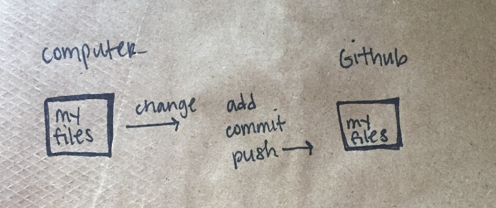
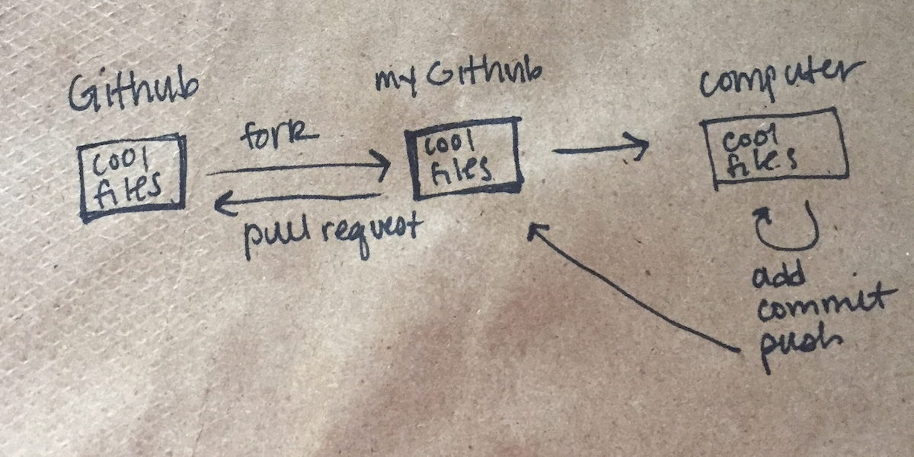

```{r setup, include=FALSE}
options(htmltools.dir.version = FALSE)
```
class: center

# R + Github adventure


Inspiration: Jenny Bryan's [Happy Git with R](http://happygitwithr.com/install-git.html#windows)

---
# R + Github Adventure


- get on GitHub  

--

- get git working  

--

- choose your own adventure!

---

# follow along

### slides
https://rladies-nashville.github.io/2017-30-05_git-r-adventure/slides

### repo
https://github.com/rladies-nashville/2017-30-05_git-r-adventure
---

class: center

#[https://github.com](https://github.com)

</img>

---

#Install git

## Windows: 
[Git for Windows](https://git-for-windows.github.io)

--

## Mac:

```
git --version
```

click install!

---
class:center

# Let's make a practice repo!

 </img>

---
# Workflow



---

# Commands

```
git init
git add .
git commit –m "first commit :tada:"
git remote add origin https://github.com/your-user-name/project-name.git
git push -u origin master
```
---

# Commands

every time you make a change:

```
git add filename
git commit –m "describe your file change here"
git push -u origin master
```

---
# Workflow



---
class: center

##[datasauRus](https://github.com/stephlocke/datasauRus/network)

 </img>

---
# choose your own adventure

